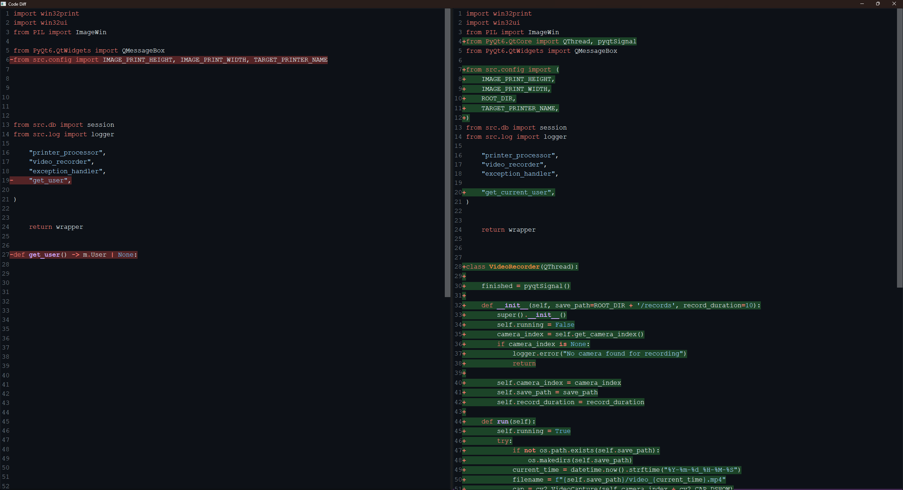

# Code Diff

[Ссылка на задание](https://docs.google.com/document/d/1Fr2Ve8ibDzvP5u0Tn2T9_VpQ2JfPO3qhFry1qGiffl8)

Используя python + pyside6 нужно сделать редактор текста (как виджет), показывающий дифф двух файлов с исходным кодом 

Должен красиво выглядеть
Иметь подсветку синтаксиса
Номера строк
Показывать что вставили и что удалили (подсветкой сзади)

Этот компонент будет использоваться в системе чтобы показать что изменил ai агент в коде.

То как должно выглядеть можно взять на гитхабе / дифф в pycharm. 

### Установка и запуск
```
pip install pipenv
pipenv install
pipenv shell
python main.py
```

### Демо

